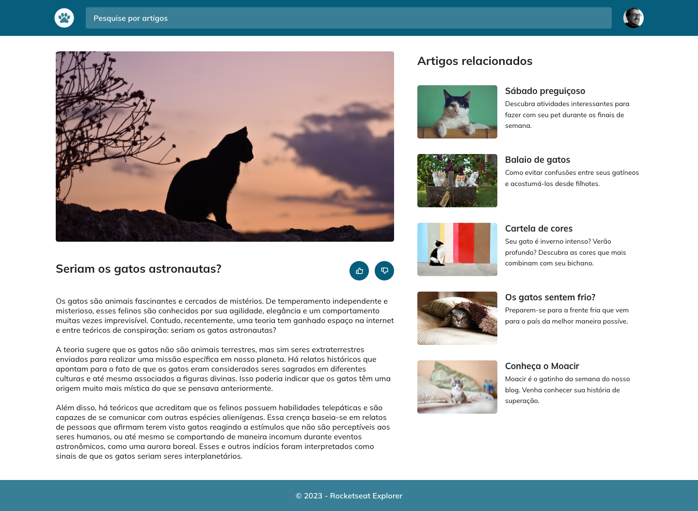

# Stage 03 - Challenge 01

## ⚔️ **Desafio - Blog dos Gatos**

### Blog dos Gatos é um projeto desenvolvido para a prática de conceitos de HTML e CSS.

## 📝 **Conceitos trabalhados**

**HTML e CSS**

- Estrutura HTML;
- Resposividade;
- Mobile First;
- Grid e Flex;
- Animações e transições simples;
- Posicionamento, alinhamento e estilização dos elementos;

### 👉🏽 Clique **[aqui](https://eduardofariasdev.github.io/stage03-cats-blog/)** e abra esse projeto no seu seu navegador.

 

🚀 **Projeto desenvolvido no programa de formação Explorer da Rocketseat.**
